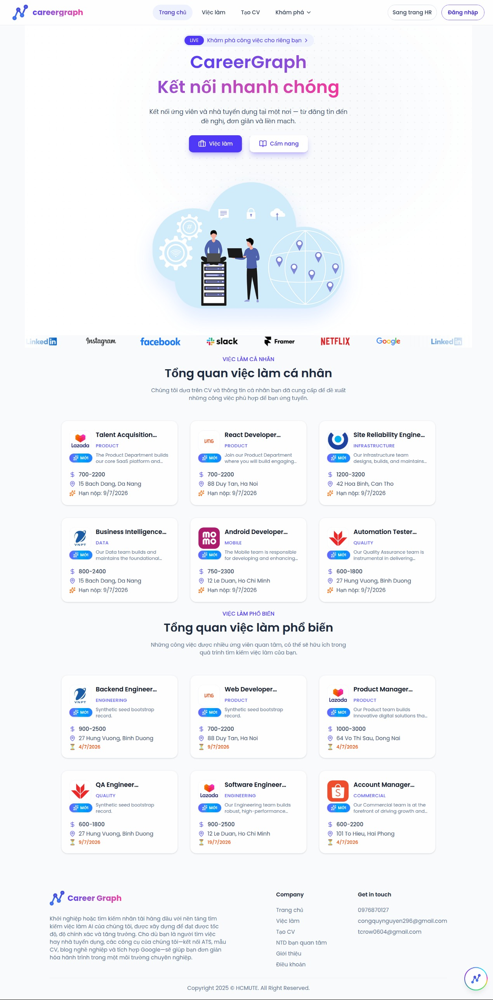
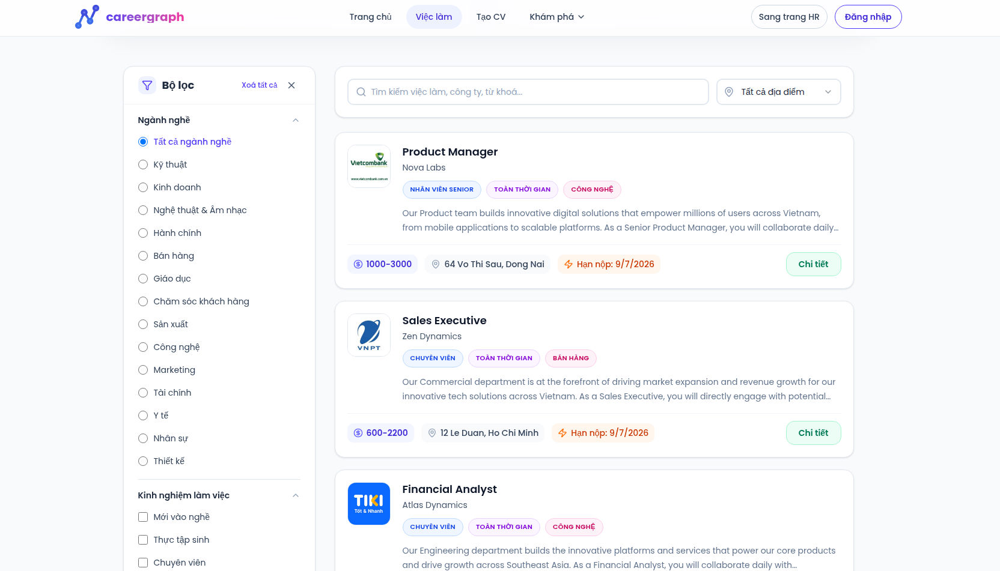
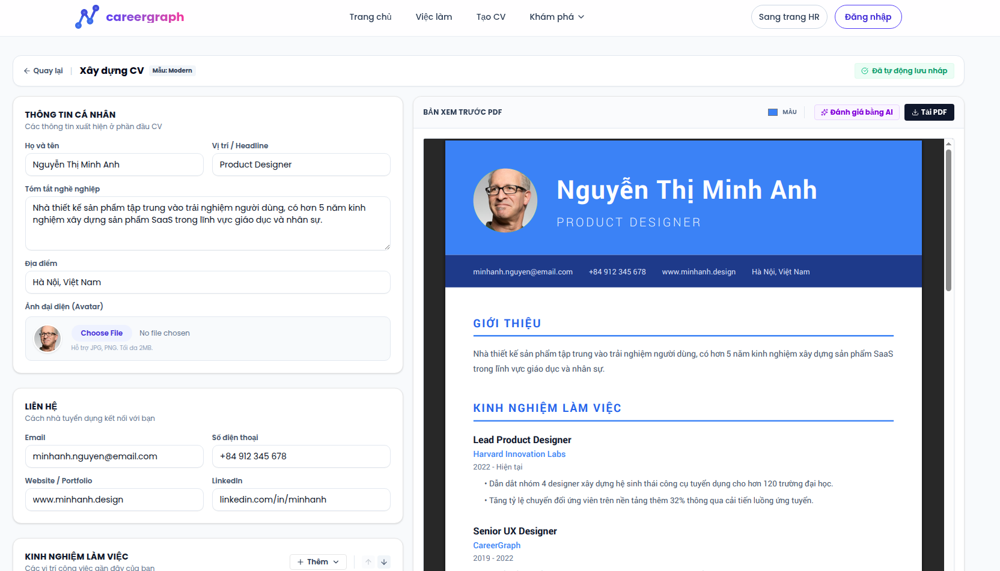
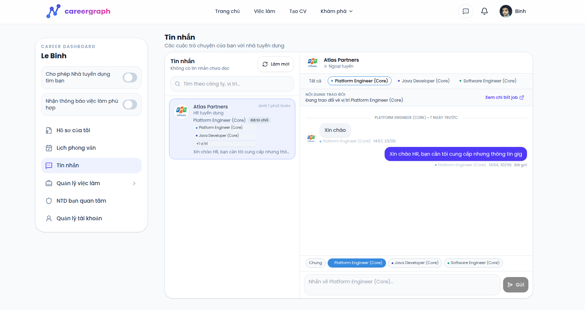
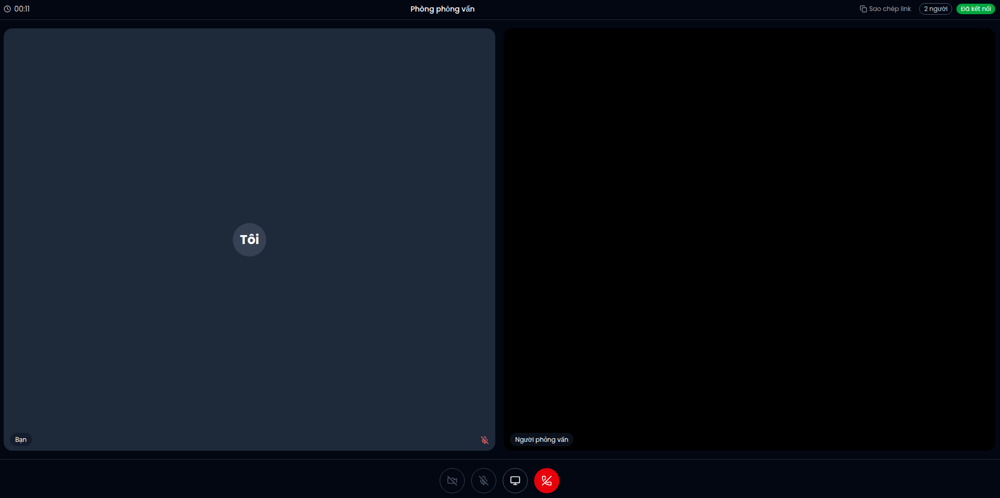

# CareerGraph Client

CareerGraph Client là ứng dụng hướng ứng viên của nền tảng. Đây là entry point chính cho người tìm việc, kết hợp trải nghiệm discovery, quản lý hồ sơ cá nhân, xây dựng CV, trao đổi với nhà tuyển dụng và tham gia phỏng vấn trực tuyến.


## Product scope

Candidate portal hiện bao gồm các nhóm trải nghiệm chính:

- landing và job discovery
- job detail và company detail
- career guide content
- authentication và account recovery
- profile dashboard
- CV templates và CV builder
- applied jobs, saved jobs và followed companies
- messaging với nhà tuyển dụng
- lịch phỏng vấn và interview room

## Product screens

Trang chủ và discovery:



Danh sách việc làm:



CV builder:



Messaging với nhà tuyển dụng:



Interview room:



## Core capabilities

- tìm kiếm và khám phá việc làm
- xem công ty và các job liên quan
- quản lý hồ sơ ứng viên
- tạo CV từ nhiều template và xuất bản trình bày phù hợp
- review CV với ngữ cảnh vị trí tuyển dụng
- nhắn tin realtime với nhà tuyển dụng
- nhận thông báo realtime
- tham gia phòng phỏng vấn trực tuyến với cơ chế kiểm tra thời gian vào phòng

## Technology

- React 19
- Vite
- React Router
- Zustand
- Axios
- Tailwind CSS 4
- Radix UI
- Socket.IO client
- `@react-pdf/renderer`
- Google Generative AI SDK

## Architecture

Ứng dụng này phụ thuộc trực tiếp vào:

- `careergraph-api` cho auth, jobs, profiles, companies, interviews, messaging metadata và media workflows
- `careergraph-rtc` cho signaling, room events và realtime presence

AI workflows được truy cập chủ yếu thông qua backend chính; phần cấu hình Gemini ở frontend chỉ đóng vai trò bổ trợ cho các trải nghiệm cụ thể trong ứng dụng.

## Code structure

```text
src/
├── components/
├── config/
├── data/
├── features/
│   ├── messaging/
│   └── notifications/
├── hooks/
├── layouts/
├── pages/
├── routes/
├── sections/
├── services/
├── stores/
└── utils/
```

## Environment model

Cấu hình môi trường được cung cấp qua các biến `VITE_*` trong local development và qua build-time environment trong production.

Các biến quan trọng:

- `VITE_API_BASE_URL`
- `VITE_RTC_BASE_URL`
- `VITE_GOOGLE_CLIENT_ID`
- `VITE_HR_SITE_URL`

Môi trường production nên được cấp qua secret manager hoặc CI/CD variables; file `.env` chỉ dùng cho local development.

## Local development

Yêu cầu:

- Node.js 20.19+ hoặc mới hơn
- npm
- `careergraph-api` và `careergraph-rtc` đang chạy

Chạy local:

```bash
npm install
npm run dev
```

Build production:

```bash
npm run build
```

## Deployment notes

- Build output là static assets từ Vite
- Cấu hình backend và RTC cần được inject ở build time
- CV builder và PDF-related flows làm tăng đáng kể kích thước bundle; đây là điểm nên tiếp tục tối ưu nếu portal mở rộng thêm

## Verification

- Build frontend đã hoàn tất thành công trong workspace hiện tại
- Bundle hiện tương đối lớn, đặc biệt quanh CV builder, PDF rendering và asset-heavy screens
